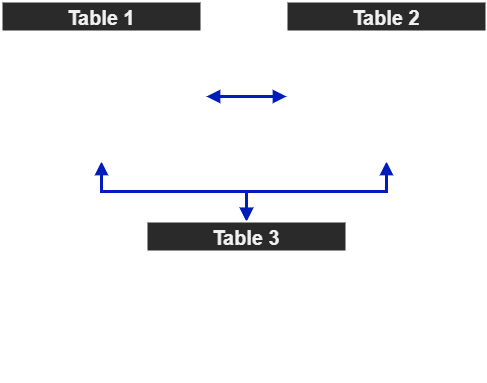
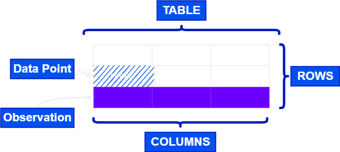

# What is SQL?

SQL stands for Structured Query Language and it's a powerful language that's used for communicating with databases. 

Every application that manipulates any kind of data needs to store that data somewhere; whether it's big data, or just a table with a few simple rows for government, or a small startup. And here where RDBMS comes into play.

RDBMS stands for Relational Database Management System. The data in RDBMS is stored in database objects called tables.



A table is a collection of related data entries and values and it consists of columns and rows.



# SQL Queries

A SQL query statement is used to query or to ask a question to the database by making use of the SQL syntax.

Combining more than one statement/command to add conditions and limitation on what data to query from the database.

A Simply query syntax template looks like this:

```SQL
SELECT <Column_name>
FROM <Table_name>
WHERE <Condition>;
```

Let's say we want to find out all the customers first and last names that are above the age of 30, then we will query our database as the following:

```SQL
SELECT FirstName, LastName
FROM Customers
WHERE Age > 30;
```

We use the `SELECT` statement to choose the **COLUMN NAMES**.
The `FROM` statement to choose the **TABLE NAMES** .

And the `WHERE` statement to choose the **CONDITION** in which the query will be filtered by.