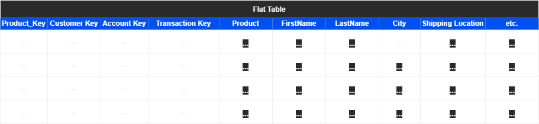
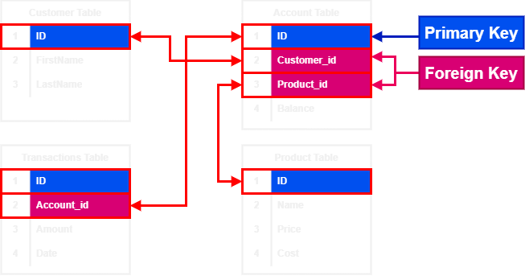

# What Are RDBMS ?

RDMS stands for Relational Database Management Systems, which are database engines that manages the relational data model.

The relational database model is simply a bunch of tables connected to each other via unique identifiers '*Primary Keys*' and '*Foreign Keys*', in order to make it easy to insert, retrieve, update data, while also reducing the redundancy and the 
unnecessary duplication of the data. 

# What Is A Table ?
A table in the RDMS is a multi-dimensional '*Entity*' object that consists of **rows** and **columns**, used to store data points as entries in vertical **rows** and it's attributes '*features*' in horizontal **Columns**.

# RD VS Flat Table
## Flat Table :
Using a flat table as a data storing schema can and will lead to a lot of problems and complications in the future as the data model gets more complex and entries (Rows) increase. Problems like 
- Drastic decline in performance
- Having to write complex queries to interact with the data
- Increase in time and space complexity
- All the data are stored in one table and in one place

## Relational Databases (RD) :
RD as a schema for a data model solves the problems presented by the flat table; as it breaks the flat table into multiple related dimensions '*Features*' and groups them into one table. 

Related tables are then connected together using unique identifiers which are called **Keys**,  keys can be used to query multiple tables together to retrieve data which are related but lives in different tables across the database.

These are two main types of keys that connect two tables together in a database, **Primary Keys** and **Foreign Keys**.

**Primary Keys** are used to uniquely identify each unique row in the table.

**Foreign Keys** are used to uniquely identify each Row in the table as in for a row to exist in the table it has to exist in another Row in another table so it can't be NULL value.

Basically a *Foreign Key*  in a table is just a *Primary Key* of another table and vice versa (as long as these two tables are connected)

In the above image blue columns are **Primary Keys** and pink columns are **Foreign Keys**. 

In the '*Account Table*' each row has a unique '*ID*' that is only set for it, as for '*`Customer_id`*' and '*`Product_id`*' both are foreign keys, so each entry (Row) in the '*Account Table*' must be linked to another entry (Row) in the '*Customer Table*' and '*Product Table*'. 

In a more simple wording we can say that : 
*In order for you to have an account you must be a customer and have bought a product.*