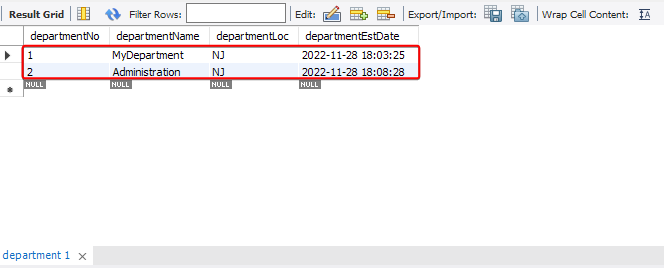
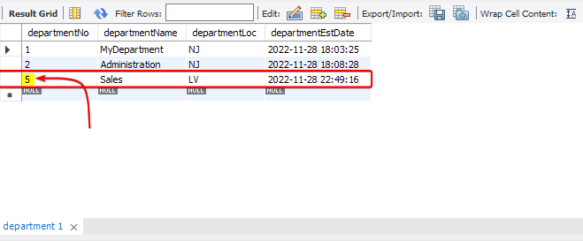
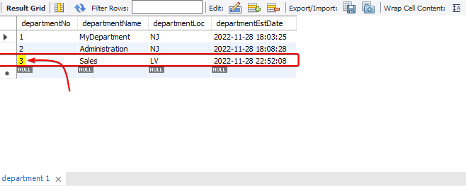

# The `ALTER` Operation 

The `ALTER` keyword is used to make changes to the schemas in the database. let's say you want to add or delete columns in a table, then you should use `ALTER`. For example it can be used to rename tables like the following :

```SQL
ALTER TABLE departmentdemo RENAME TO departmentcopy;
```

The above SQL statement will rename `departmentdemo` table to `departmentcopy`.

# Manipulating the Auto-Increment Values in a Table

Let's go back to the `department` table and use the `ALTER` keyword to manipulate the auto-increment values.


1. Delete the rows where `departmentNo` is greater than 2; this will delete the two rows where `departmentNo` is 3 and 4!

```SQL
DELETE FROM department WHERE departmentNo > 2;
```

2. Select the `department` table to get a preview of the existing rows in the table :



3. Now, insert the sales department into the `department` table :

```SQL
INSERT INTO department (
	departmentname,
	departmentLoc
)
VALUES (
	'Sales',
	'LV'
);
```

4. On selecting the rows, we can see that the auto_increment column starts at 5:



5. Delete the newly inserted Sales department :

```SQL
DELETE FROM department WHERE departmentNo = 5;
```

6. Run the `ALTER TABLE`statement to reset the auto_increment column to 3 :

```SQL
ALTER TABLE department AUTO_INCREMENT = 3;
```

7. Insert the Sales department again :

```SQL
INSERT INTO department (
	departmentname,
	departmentLoc
)
VALUES (
	'Sales',
	'LV'
);

SELECT * FROM department; -- Selects all the rows from the department table
```

The output will be as follows :

