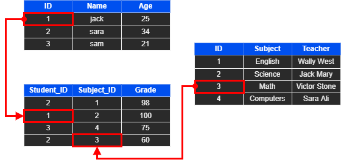
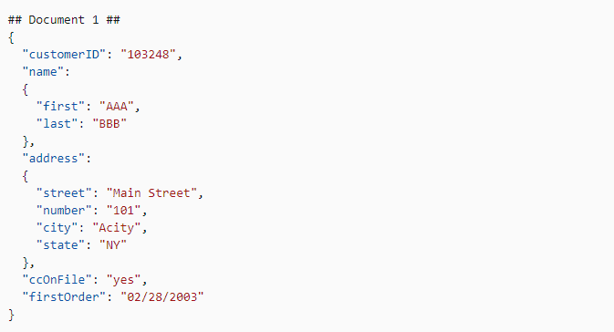
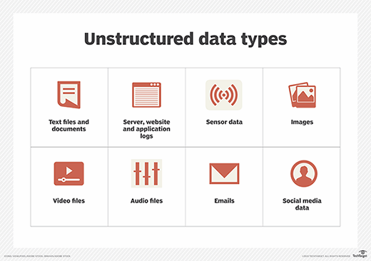
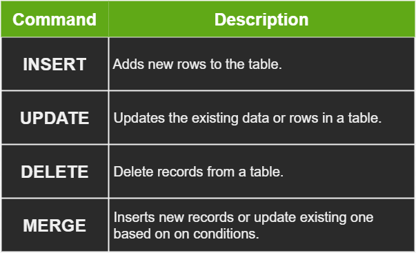
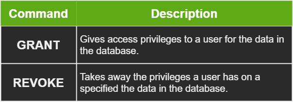
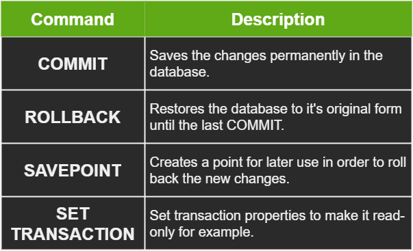
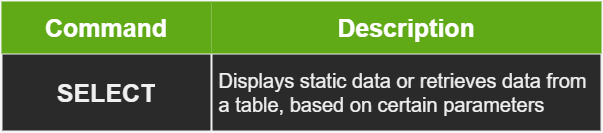

# Quick Intro 

Most Businesses and companies work with large amounts of data every day. Most people who work with data use spreadsheet software like Excel to manipulate and analyze data, but as the size and complexity of data increases, these tools become inefficient.

SQL introduces a powerful and efficient way to work with data as it's the language used to communicate, query, and control data in databases. 

# Data Types

Data is classified into three types Structured data, semi-structured data, and unstructured data.

## Structured Data :
**Structured data** mostly comes or is stored in **tabular form** represented by columns and rows in a database. These databases are called relational databases.

## Semi-Structured Data :
**Semi-structured** data is information that doesn’t consist of Structured data (relational database) but still has some structure.
Semi-structured data consist of** documents stored in JavaScript Object Notation** (JSON) format. It also includes key-value stores and graph databases.

## Unstructured Data

**Unstructured data** is information that either does not organize in a pre-defined manner or not have a pre-defined data model. 

Unstructured information is a set of text-heavy but may contain data such as numbers, dates, and facts as well.

**Videos, audio, and binary** data files might not have a specific structure. They’re assigned to as **unstructured** data

# Basic SQL Commands 

To write a query in SQL we combine different commands together, these commands are classified into sub-languages of SQL. 

There are five sub-languages in SQL :

1. Data Definition Language (DDL)
2. Data Manipulation Language (DML)
3. Data Control Language (DCL)
4. Transaction Control Language (TCL)
5. Data Query Language (DQL)

## Data Definition Language (DDL) :

Any command that is used to create something in SQL is part of DDL.  
The following table shows the DDL commands :

## Data Manipulation Language (DML) :

When updating the data itself, or performing calculations or operations, we use the DML.

DML allows you to work on the data without modifying the containers (Tables or database).

A copy of the data is created and the operations are performed on this  
copy of the data. These operations are performed using the DML. 

The following table shows the DML commands :

## Data Control Language (DCL) :
 These commands They control access and authorization to the data.

The following table shows the DCL commands :

## Transaction Control Language (TCL) :

Any change to the data in a relational data base is considered a transaction.

When manipulating the data, the manipulation happens to data in a temporary location and not in the  table or database itself.

In order to actually apply these changes to the database itself we use TCL.

The following table shows the TCL commands :

## Data Query Language (DQL) :

DQL is used to fetch data from the database with the SELECT command.

It's explained in the following table :

