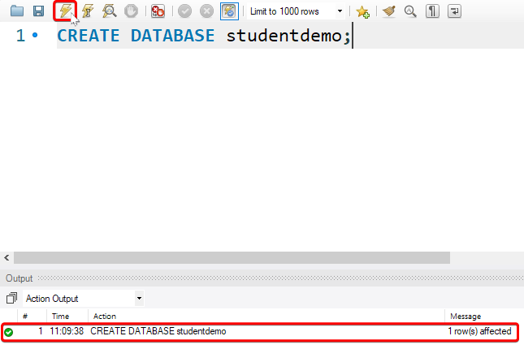
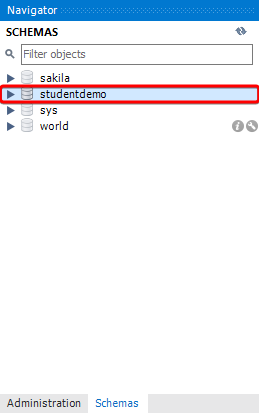
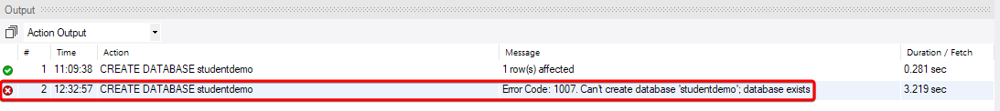
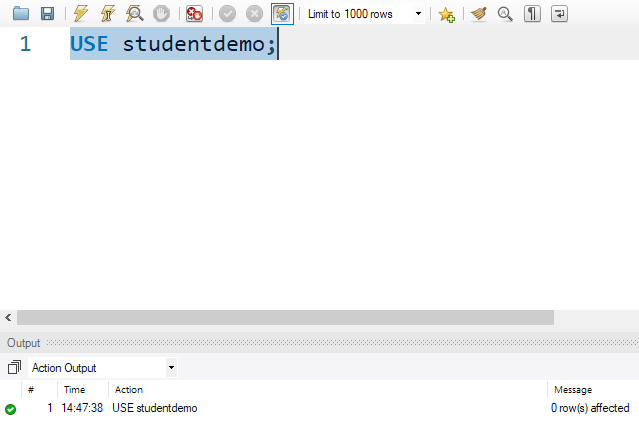
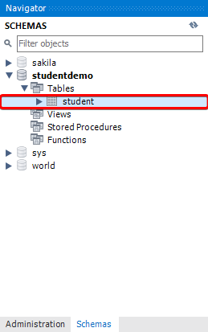
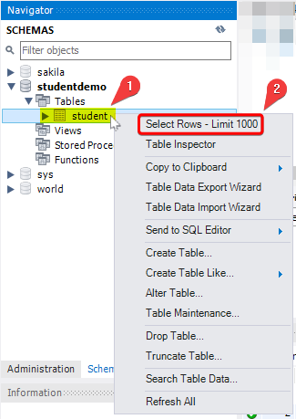
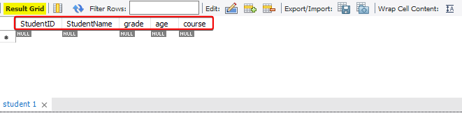

# Create a database 

To Create a database we use the `CREATE DATABASE` command followed by the database name.

Lets create a simple example database and call it `studentdemo`, to do that we will use the following command :

```SQL
CREATE DATABASE studentdemo;
```

To run this command click the execute button :



Notice in the **Action Output** pane the table has been created successfully. 

You can also check out the newly created database `studentdemo` in the Schemas tab in the Navigator pane on the left.



If we tried to create another database with the same name as `studentdemo` we are going to get an Error as there can't be two existing databases with the same name.



# Creating A Simple Tables

To create a table in SQL we use the `CREATE TABLE` command, the `CREATE TABLE` command allows us to setup and configure the table's columns, relationships, and constraints.

After the `CREATE TABLE` command we pass the name of the table and the list of columns. 

At the minimum for every column, you must provide the column name and data type the column will hold.

Let's create a table called `Student` and add it to the database we created earlier `studentdemo`, the `Student` table will contain the following columns :

- **Student name** : The student full name.
- **Student ID** : A value to identify each student uniquely.
- **Grade** : Each student is graded as A,B or C.
- **Age** : Age of the student.
- **Course** : The course the student is enrolled into.

***

1. First we will need to set the current database to `studentdemo`, to that we use the `USE` keyword followed by the database name :



2. Create the table `Student` in the `studentdemo` database :

```SQL
CREATE TABLE Student (  
	StudentID    CHAR (4),
	StudentName  VARCHAR (30),
	grade        CHAR(1),
	age          INT,
	course       VARCHAR(50),
	PRIMARY KEY  (StudentID)  
);
```

The `student` table we created contains the following columns :

-  **StudentID** : will contain four character values. 'S001', 'ssss', and 'SSSS' are all valid inputs and can be stored in the StudentID field.

-  **grade** will just contain a single character. 'A', 'F', 'h', '1', and 'z' are all valid
inputs.

-  **StudentName** : will contain variable-length values, which can be 30 characters in size at most. 'John', 'Parker', 'Anna', 'Cleopatra', and 'Smith' are all valid inputs.

-  **course** : will also contain variable-length values, which can be 50 characters in size at most.

-  **age** : will be an integer value. 1, 34, 98, 345 are all valid values.

**StudentID** : is set as the primary key. This will generate a unique value for each field in the StudentID column and no value can be empty or NULL.

The Primary key **StudentID** will enable us to uniquely identify any record in the Student table using it.

> #### Note :
> NULL is used to represent missing values.

After creating the table we can check it out in the Schemas tab in the Navigator pane on the left.



We can also view the table content (Columns) from the Navigator pane. 

To do so, Right-Click on the `student` table and choose the first option 'Select Rows - Limit 100'



A new pane will pop-up at the bottom with the Result grid showing the `student` table rows (Limited by 1000).



Of course the table is empty here because we didn't populate it with any data. We will cover this in *Manipulating data in SQL*
***