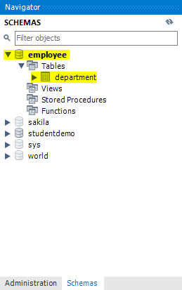
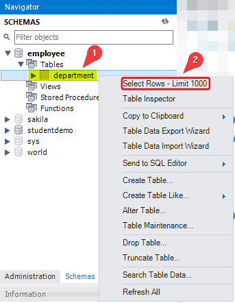
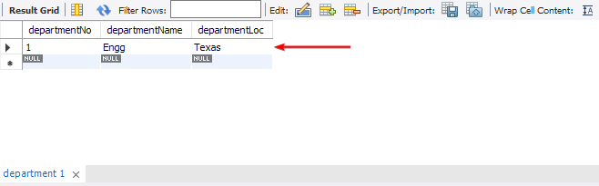
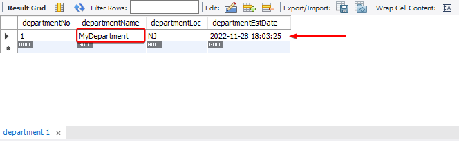
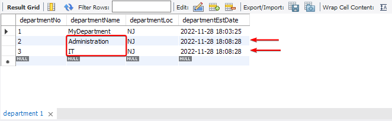
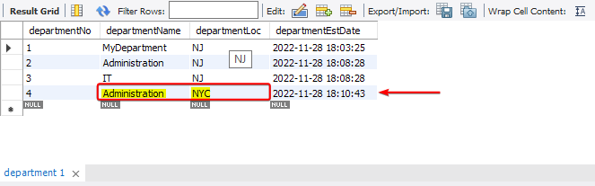

# Quick Intro

In the previous section [[SQL Basics]] we created a database and a table, but we didn't insert or populate them with any data. In this section we will explore SQL (`INSERT`, `UPDATE`, `DELETE`, `ALTER`) commands Data manipulation language (DML) in SQL.

# The `INSERT` Operation 

The `INSERT` operation is used to add/insert records into a table, before we go into more details about it. There are some important points to be made first :

- When performing an `INSERT` you don't always have to provide data for every column. This means that some columns can be left blank unless there is a rule\constraint that forbids it.

- The inserted columns values have to match the order, data type, and size requirements.

- Strings, data-time, and characters values must be enclosed in quotes.

- In case you didn't specify the column name in the `INSERT` statement, you should provide a value for all the columns in the table you are inserting into, maintaining it's values sequence.

- The `INSERT INTO` only accepts one table name as an argument, so you can only insert values into one table at a time.

# Performing a Simple `INSERT`

The `INSERT` statement begins with `INSERT INTO`, followed by the table name. Then, you specify the name of the columns you are inserting data into. 

It is mandatory to insert data into the columns that require information (for example, columns that are specified as NOT NULL, or a column that is selected as the primary key).

Also, there may be columns with default values; these don't need to be provided with data either, unless it's necessary.

After specifying the name of the columns, you use the `VALUES` clause to enter the values of these columns.

if you specify a column name you have to provided data for it. If you do not wish to insert data into a column, then do not specify the column name in the `INSERT INTO`.

Now lets put what we learned into practice.

## Inserting One Row of Data into a Table 

we'll implement the `INSERT INTO`...`VALUES` SQL statement to add records to a table. First, we'll create an EMPLOYEE database and then we'll add a table to it. Next, we'll insert values into the table with the `INSERT` SQL statement and finally display the contents of the table. To do so, let's go through the following steps :


First, let's create a new database `EMPLOYEE` and add a new table to it `department` :

1. Create an `EMPLOYEE` database :

```SQL
CREATE DATABASE EMPLOYEE;
```

2. Create a `department` table, with `departmentNo` as it's PRIMARY KEY :

```SQL
CREATE TABLE department (  
	departmentNo   INT PRIMARY KEY,  
	departmentName VARCHAR(20) NOT NULL,  
	departmentLoc  VARCHAR(50) NOT NULL  
);
```

If we check the Schemas tab in the Navigator pane we can see the newly create database and table (`employee` and `department`) 



1. Now let's insert values into the `department` table :

```SQL
INSERT INTO department (  
	departmentNo,  
	departmentName,  
	departmentLoc  
)  
VALUES (  
	1,  
	'Engg',  
	'Texas'  
);
```

To see the row we just inserted into the table, From the Navigator pane, select the Schemas tab. Select EMPLOYEE | Tables |  
department | Select Rows - Limit 1000.



The expected output is as follows :



# Performing Multiple Inserts

The `INSERT` command can be used to insert more than one value into a table at once, This can be done by explicitly specifying the value for multiple rows in the VALUES clause.

## Specifying Default Values

Specifying a default value is simple; all you must do is use the `DEFAULT` keyword and specify the default value or a function that gets you the default value.

Lets assume that all the departments of your company are centered at the headquarters in **New Jersey**, unless specified otherwise. 

We will also assume that every department has a record of the date that it was established. 

You are required to define your table accordingly. In this case, we will need a default value for the other columns in the database. 

Let's go through the following steps:

1. We already have a table called department, but it does not have a column to capture the established date. We will therefore drop the department table first and then create a new table. This allows us to overwrite it. The syntax for this is `DROP TABLE IF EXISTS` :

```SQL
DROP TABLE IF EXISTS department;  

CREATE TABLE department (  
	departmentNo      INT PRIMARY KEY AUTO_INCREMENT,  
	departmentName    VARCHAR(20) NOT NULL,  
	departmentLoc     VARCHAR(50) DEFAULT 'NJ',  
	departmentEstDate DATETIME DEFAULT NOW()  
);
```

We have provided default values for `departmentLoc` and `departmentEstDate`.

The `departmentNo` column is an auto-increment column. 

This means that you do not explicitly control the values that go into the column. 

Your attempt to insert data into the column will raise an error in response. If you would like to control the values, you need to alter the table to reset the auto-increment value before inserting the values in the identity columns.

2. Let's set up a new department called *MyDepartment*, located in New Jersey. We will set the date the department was established as today.

```SQL
INSERT INTO department (  
	departmentName  -- Column name
)  
VALUES (  
	'MyDepartment'  -- Value to insert
);
```

3. To check out the record we just inserted From the Navigator pane, select the Scheme's tab. Select EMPLOYEE | Tables | department | Select Rows - Limit 1000.



Similarly, you can add multiple rows to the table, and the default columns will pick their values accordingly. Say that you would like to add two more departments, Administration and IT

1. Adding multiple values to the `department` table :

```SQL
INSERT INTO department (  
	departmentName,  -- Column name
	departmentLoc    -- Column name
)  
VALUES  
-- First Value (Row)
(  
	'Administration', -- Value to insert
	DEFAULT      -- Default value of 'departmentLoc'
),  
-- Second Value (Row)
(  
	'IT',           -- Value to insert
	DEFAULT         -- Default value of 'departmentLoc'
);
```

5. After executing the command (by clicking the Execute button), inspect the contents of the table. The expected output is as follows :



We can see from the output that the default values were automatically added. Also, if you would like to explicitly ask SQL to insert the default values, you could do that as well by using the `DEFAULT` keyword.

However we can override the default value as well.

1. lets insert a department, Administration, that is in NYC, run the following command :

```SQL
INSERT INTO department (  
	departmentName,  ****
	departmentLoc
)  
VALUES  
(  
	'Administration',  
	'NYC'  
);
```

7. View the contents of the `department` table, from the Navigator pane. The table will look as follows :

