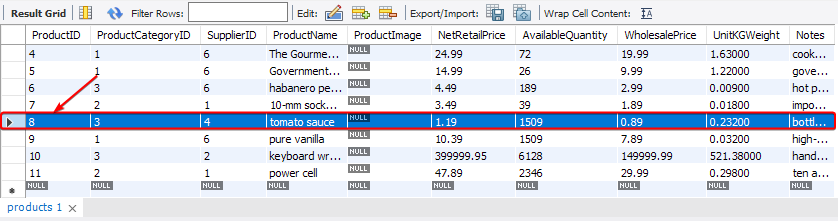
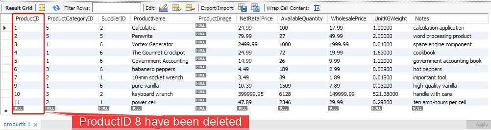

# The `DELETE` Operation 

The `DELETE` statement deletes one or more rows within a table. Just like the `INSERT` operation it only works with one single table at a time. You should be careful when performing a deletion as it's permanent.

Most of the time you will need to add a condition to the `DELETE` statement you are performing unless you want to delete all the rows in the table, this can be done using the `WHERE` clause (We will cover the `WHERE` clause in more details later).

Let's say that you have an employee with an ID of `empno 1234` which is no longer working for the company and you want to delete his record :

```SQL
DELETE FROM employees
	WHERE empno = 1234;
```

If you would like to remove the top 5 rows from the employees table, we would use the following query :

```SQL
DELETE FROM employees
	LIMIT 5;
```

# Deleting a record from a table

Consider that you have a product called 'tomato sauce' that is no longer available in you store **`My_Online_Store`** database, and you want to remove it to reflect you stock. To do this, perform the following steps :

1. Inspect the contents of the products table, you should see the product tomato sauce present in there. Its product id is 8



2. Enter the following query :

```SQL
USE my_online_store;
DELETE FROM products
	WHERE ProductName = 'tomato sauce';
```

> ### NOTE :
> You might get an error here, because you are operating in Safe Mode. To disable Safe Mode, go to **Edit | Preferences | SQL Editor** and uncheck the Safe mode option. Once you do this, reconnect to the database, and the query should execute successfully.

3. Now, in the **Navigator pane**, go to **Schemas**, and then click **`my_online_store` | tables | products | Select Rows -Limit 1000.** You should get the following output :



Notice that tomato sauce is no longer in the list.