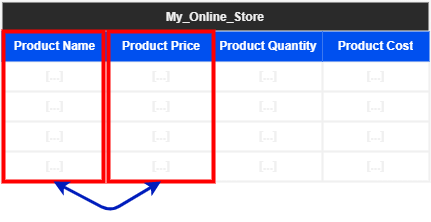
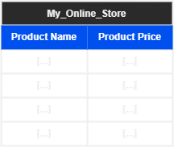

# Quick Intro

In the previous sections when we wanted to see the content of a table 'Query the table' we used the `SELECT *` statement or went to the **Navigator Pane | Right-Click | Select Rows - Limit-1000**. 

However, most of the time you will find yourself only interested in specific content in the table (Columns). 

For example let's say we have a database for our online store that include columns like **Product Name**, **Product Price**, **Product Quantity**, and **Product Cost**. 

But we only want the **name** and **price** of the products to be shown on our website. 



Then these are the columns of the table we want :



Using the `SELECT` statement, we can choose specific columns from a table.

The syntax of a typical SQL query look something like this :

```SQL
SELECT [COLUMNS_NAMES]
FROM [TABLE_NAME]
WHERE [CONDITION]
ORDER BY [COLUMN_NAME] [ASC|DESC]
```

- **[COLUMNS_NAMES]** : Is replaced by the column names you want, separated by commas.

- **[TABLE_NAME]** : Is replaced by the table name you want to get data from.

- **[CONDITION]** : Is the condition to filter down the results by.

- **[COLUMN_NAME]** : Is the column in which the results will be ordered/sorted by.

- **[ASC|DESC]** : IS the order option, ASC = ascending and DESC = descending

We will focus in this section about the basics of the `SELECT` statement, and will go in more detail on how to filter data using the `WHERE` clause in another section.

# What Does the `SELECT` Statement Do?

The `SELECT` statement is used to select one or more column from a table, thus defining what the columns of the output should look like. The `SELECT` and `FROM` statements are mandatory when querying data.

> #### IMPORTANT NOTICE
> Make sure you run these scripts to setup the databases and table for next examples

# Retrieving All Columns of a Table

The store manger want to get information about all the categories of items available in `my_online_store`.
we can do that using the following query :

```SQL
-- Switching to the my_online_store database
USE my_online_store;
-- Selecting all columns from the ProductCategories table
SELECT * FROM ProductCategories;
```

The following output is shown after executing the query :


# Selecting Limited Columns

What happens if we want to retrieve specific columns from a table, we will have to mention those column names after the `SELECT` keyword with each column name followed by a comma.

## Selecting Specific Columns from a Table

After the store manger got the information about all the categories of items available, he now wants to check the `ProductCategoryId` of all the categories in the `my_online_store` along with `ProductCategoryName`. to retrieve these column we do the following :

```SQL
-- Switching to my_online_store database
USE my_online_store;
-- Selecting wanted columns
SELECT ProductCategoryId, ProductCategoryName
-- Choosing the table to query from
FROM ProductCategories;
```

This query will result in the following output :


Note that the columns are displayed in the exact order they were mentioned in the `SELECT` statement, So if we want to show the name of the category first followed by ID, we use the following statement :

```SQL
SELECT ProductCategoryName, ProductCategoryID
FROM ProductCategories;
```

This query will result in the following output :


# Using Naming Aliases

Sometimes when querying data from a table, the column names can be long to type or not clear or relatable to the context of the report you are using this data for, also it might make the query look complicated. 

This can be solved using *Naming Aliases*, Simply follow the *Original table name* with the `AS` keyword followed by the *New alias name*. The syntax looks like the following :

```SQL
SELECT [COLUMN ORIGINAL NAME] AS [COLUMN NEW NAME]
```

## Aliasing the Column Headers

Lets say that when we publish the report, we want to rename the column headings of the previous query as **CATEGORY** and **ID**, respectively. To do this, perform the following steps :

```SQL
SELECT ProductCategoryName AS CATEGORY, 
	   ProductCategoryID AS ID
FROM ProductCategories;
```

Execute the query. It will result in the following output :


In case we want to use multiple words with spaces between them, use the full name between single quotes ' ', as follows :

```SQL
SELECT ProductCategoryName AS 'PRODUCT CATEGORY', 
	   ProductCategoryID AS ID
FROM ProductCategories;
```

The output of the query would be as follows:

