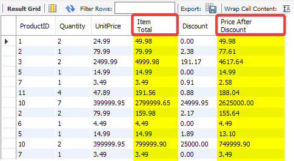

# Using Mathematical Expressions

Sometimes, you will not find all the information you need in the database fields. And you will need to perform some mathematical expressions on you data to get the results you want. We are going to explore in this section how can you calculate expressions with the `SELECT` statement.

Mathematical expressions can be a combination of addition, subtraction, multiplication, and division, so your options in creating an expression are almost endless.

# Calculating the Item Total

We want to calculate the items total in our `OrderItems` table, to calculate that we can use the *quantity* and *unit price* columns in the following expression :

```SQL
SELECT ProductID, Quantity, UnitPrice,
	   (Quantity*UnitPrice) AS 'Item Total'  
FROM OrderItems;  
```

Execute the query. Your result will be as follows :


we used a multiplication expression to get the item total. It's simple but can get complicated very easily, so we always recommend using **parentheses**
whenever possible to make sure the expression is correct and clear.

# Calculating Discount

There is a Discount field in the `OrderItems` table. Let's use this field with another expression to calculate the item price after the discount using the following steps :

```SQL
SELECT 
	ProductID, Quantity, UnitPrice, 
	(Quantity*UnitPrice) AS 'Item Total', 
	Discount,
	((Quantity*UnitPrice)-(Quantity*Discount)) AS 
	'Price After Discount'
FROM OrderItems;
```



Like we can see, We can use all math calculations effectively, and quickly retrieve data.