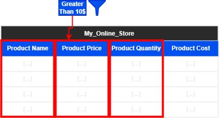
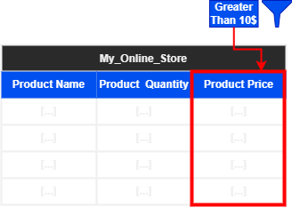
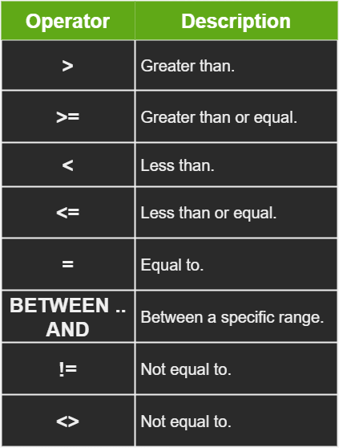

# Quick Intro 

In the previous sections we saw how to extract and sort data from tables. However, in practice, in a lot of situations we will find ourselves needing to filter our results based on certain conditions and criteria. 

For example let's go back to our `my_online_store` table. Lets say we only want the `Product name` and `Quantity` of products that their price is more than 10$.

The relevant columns are shown in the following table. 



The filtered result will look something like the second table in the following :



The `WHERE` clause in SQL allows is to apply the filter functionality. We will go into details in this section about using the `WHERE` clause in our queries.

# The WHERE Clause Syntax

The `WHERE` clause is optional and can be added to the `SELECT` statement, usually after the `FROM` clause, as follows :

```SQL
SELECT [COLUMNS_NAMES]
FROM [TABLES_NAMES]
WHERE [CONDITIONS] -- WHERE clause in query
ORDER BY [COLUMNS_NAMES] [ASC|DESC]
```
Conditions in SQL are **logical operators** that can be used for comparison. Condition operators are listed in the following table :



These operators can be used to compare two fields/values to achieve the desired results.

A simple implementation of a `WHERE` clause is as follows :

```SQL
USE studentdemo;
SELECT *
FROM Student;
```

The sample Student table looks like this :


Using the `student` table from the `studentdemo` database, we want to know the names and IDs of the students enrolled in the Computer course, To do so we will use the following query :

```SQL
SELECT *
FROM student
WHERE course = 'Computer';
```

We can see that 'Ali' is the only one enrolled in the 'Computer' course.


# Implementing Logical Operators in the `WHERE` Clause

The store manger wants to find out what are the products that are priced over $14.99 and wants them to be labeled as high-value products. We will do that with the following query :

```SQL
USE my_online_store;
SELECT ProductName AS 'High-value Products', NetRetailPrice
FROM Products
WHERE NetRetailPrice > 14.99;
```

The result will be as follows :


If we want to also include the products that have a `NetRetailPrice` of $14.99 we will have to use the **>=** (Greater than or equal operator) like the following :

```SQL
USE my_online_store;
SELECT ProductName AS 'High-value Products', NetRetailPrice
FROM Products
WHERE NetRetailPrice >= 14.99;
```

# Using the BETWEEN Operator

The store manager now wants to know all the items in the range of $14.99 to $50 as mid-priced items. We will do that with the following query :

```SQL
SELECT ProductName, NetRetailPrice
FROM Products
WHERE NetRetailPrice BETWEEN 14.99 AND 50
ORDER BY NetRetailPrice;
```

The result will be as the following :
 


Note that products with the price range ($14.99 and $50) will also be included in the results if they are available.

# The Not Equal Operator

SQL supports the following symbols to denote the not equal operator: != and <>. The not equal operator will exclude the conditions where values are equal in the results.

# Using the != and <> Operators

The store manager realizes that the tomato sauce has gone bad, so he does not want to present it in the list of available items. 

To write a query to display all the products except the tomato sauce, perform the following steps :

```SQL
ELECT ProductName, NetRetailPrice
FROM Products
WHERE ProductName != 'tomato sauce'
ORDER BY NetRetailPrice;
```

We will get the following results:


As an alternative, now replace the != symbol with the <> operator :

```SQL
SELECT ProductName, NetRetailPrice
FROM Products
WHERE ProductName <> 'tomato sauce'
ORDER BY NetRetailPrice;
```

We get the same results as before : 

