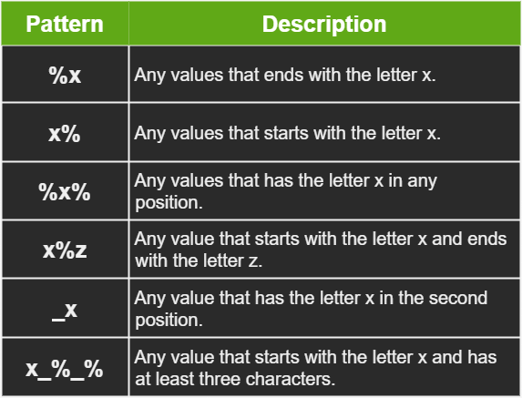

# The LIKE Operator

Sometimes, we face situations where we want to retrieve data with a specific pattern.

Let's say we want to get all the customers that their name starts with an 'A', or any customer that has 'Joe' in their name.

This is where the `LIKE` operator comes in. Just like the other operators it's used with the `WHERE` clause.

Syntax example :

```SQL
SELECT [COLUMNS_NAMES]
FROM [TABLES_NAMES]
WHERE [COLUMNS_NAMES] LIKE '[PATTERN]'
```

In the `LIKE` pattern condition, there are two wildcards that can be used together to
create a pattern:

- **%** represents zero or multiple characters.

- **_** represents a single character.



Let's see an example. To search for first names that have **o** in the second position, the following query can be run :

```SQL
SELECT FirstName, LastName, Phone
FROM Customers
WHERE FirstName LIKE '_o%';
```

The output will be as follows :


# Using the LIKE Operator to Check a Pattern at the Beginning of a String :

We want a list of customers from LA. We don’t currently have any field specifically mentioning the state/country, but since we record the customers phone details, we can filter the phone numbers that start with the code for LA (310), as follows :

```SQL
SELECT FirstName AS 'Customers from LA', Phone
FROM Customers
WHERE Phone LIKE '(310)%';
```

The result should be as follows :


# Using the `LIKE` Operator to Check for a Specified Length

We want to provide usernames to our customers so they can log into our system. We want to create each username from the customer's first name. However, our system does not allow three-letter usernames. 

The store manager will have to pull up a report on all the customers with three-letter usernames. To do so, perform the following :

```SQL
SELECT FirstName, LastName, Phone
FROM Customers
WHERE FirstName LIKE '___';
```

The following records will be returned :


# Combining Conditions with the AND, OR, and NOT Operators

On many occasions, we may need to combine multiple conditions. We can do this by using the following three operators.

- **AND** : This operator makes sure both sides of the operator (both conditions) are true.

- **OR** : This operator makes sure one side at least of the operator is true.

- **NOT** : This operator makes sure that the condition following this operator is false.

# Querying Multiple Conditions

Joe, a customer from LA, has requested to speak to the store manager regarding a complaint. 

Let's write a query to gather all of Joe's customer information. This will help the manager to resolve the Joe's complaint.
The state code for LA is (310). To pull the required information, perform the following :

```SQL
SELECT *
FROM Customers
WHERE FirstName = 'Joe' AND Phone LIKE '(310)%';
```

This gives the following result :


To make sure that we got the details about the right customer 'Joe', we are also going to search for all the customers that either named 'Joe' or live in LA.

```SQL
SELECT FirstName, LastName, Phone
FROM Customers
WHERE FirstName = 'Joe' OR Phone LIKE '(310)%';
```

As required, the result is displaying all customers with either the first name Joe or a phone number that starts with (310):


There are no other Joes in our system, and there is nobody else in LA who has a similar name to Joe. So, we can be fairly confident we have got the correct person.

Now, let's say that we have a scenario where we need to list all customers that have a first name starting with **Jo** and a phone number that starts with (310) or (210), but who don't have a last name of **Carter**. This is a perfect scenario to use all operators in one query :

```SQL
SELECT FirstName, LastName, Phone,Notes
FROM Customers
WHERE FirstName LIKE 'Jo%' AND 
	(Phone LIKE '(310)%' OR 
	Phone LIKE '(210)%') AND NOT
	LastName = 'Carter';
```

This returns the records shown here :


We used parentheses to separate the **OR** comparison and compare the full block with the first condition of the first name.