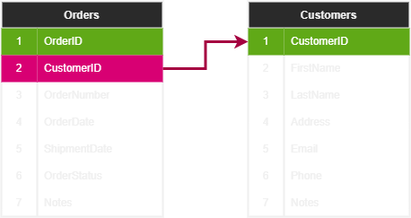
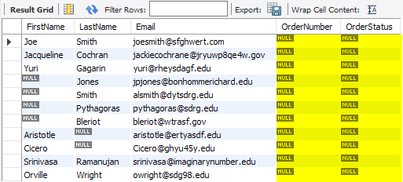
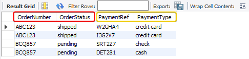
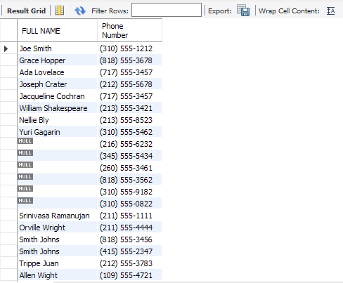

# Quick Intro

Having a single table to store all the data is not feasible because of it's maintenance will be extremely difficult. Also, In many cases, not all the data we want can be found in a single table. This where SQL *JOINS* comes in, we can use join to connecting tables and retrieve data from them.

We can use the `JOIN` operation to extract data from multiple tables that have common
columns using a single query. Based on the data that's required, there are various types
of joins that are supported by SQL.

- **INNER JOIN**
- **RIGHT JOIN**
- **LEFT JOIN**
- **CROSS JOIN**
- **UNION**

# INNER JOIN

The INNER JOIN is the default type of join that is used to select data with matching values in both tables. 

It can be represented with the following Venn diagram :


Let's have a look at the `INNER JOIN` syntax:

```SQL
SELECT [COLUMNS_NAMES]
FROM [TABLE_1] 
INNER JOIN [TABLE_2]
	ON [TABLE_1 COLUMN_NAME] = [TABLE_2 COLUMN_NAME]
WHERE [CONDITION]
```

The `INNER JOIN` is one of the most commonly used type of joins.

# Extracting Orders and Purchaser Information

You are a store manager that needs to extract the details of all the orders, along with the customer details from the `my_online_store` database. To do so, follow these steps :

1. Let's first take a look at the table containing the data we want.



As you can see, the `Orders` table and the `Customers` table both contain the `CustomerID` column. In order to join the two tables, we need to map the `CustomerID` columns of the `Orders` table to those of the `Customers` table.

1. Open a new query window, switch to the `my_online_store` database, and type the
following query :

```SQL
SELECT Orders.OrderNumber, Orders.OrderStatus,
	   Orders.OrderDate,
	   
	   Customers.FirstName, Customers.LastName, 
	   Customers.Email
	   
FROM Orders 
JOIN Customers 
	ON Orders.CustomerID = Customers.CustomerID;
```

3. Execute the query. Your output should be as follows :


In the syntax, we have specified the join criteria by using `Orders.CustomerID = Customers.CustomerID`. 

This resulted in six records as output (which are the complete records of the Orders table), along with the fields from both tables.

The key element is to make sure that your join criteria are **correct based on the shared columns between your joined tables**.

# RIGHT JOIN

This type of join is used when you want to select records that are available in the second table and matching records in the first one. 

This can be visualized with the following Venn diagram :


As we can see, the `RIGHT JOIN` represents the highlighted section, that is, **TABLE B**, and the intersected section of **TABLE A** 

RIGHT JOIN Syntax :

```SQL
SELECT [COLUMNS_NAMES]
FROM [TABLE_1] 
RIGHT OUTER JOIN [TABLE_2]
	ON [TABLE_1 COLUMN_NAME] = [TABLE_2 COLUMN_NAME]
WHERE [CONDITION]
```

# Implementing RIGHT JOIN

The store wants the list of customers, along with their orders, and also wants to include customers **who haven't purchased anything from the store yet**.

The challenge here is to show customers who haven't ordered yet—that's why, in this case, it would be perfect to use the `RIGHT JOIN`.

```SQL
SELECT 
	Customers.FirstName,
	Customers.LastName,
	Customers.Email,
	
	Orders.OrderNumber,
	Orders.OrderStatus
	
FROM Orders 
RIGHT JOIN Customers
	ON Orders.CustomerID = Customers.CustomerID
```

We get the following output :


From the above results we can see that there are some records with **NULL** values in the `OrderNumber` and `OrderStatus` fields.

To extract a list of customers who haven't placed any orders from the store, we can use
the following query :

```SQL
SELECT 
	Customers.FirstName,
	Customers.LastName,
	Customers.Email,
	
	Orders.OrderNumber,
	Orders.OrderStatus
	
FROM Orders 
RIGHT JOIN Customers 
	ON Orders.CustomerID = Customers.CustomerID
WHERE Orders.OrderNumber IS NULL
```

Result :



# LEFT JOIN 

This type of JOIN is used when you want to select records that are available in the first table and match records in the second one. 

It can be represented with the following Venn diagram :


The `LEFT JOIN` represents the highlighted section from **TABLE A** and the intersected
section from **TABLE B**. Let's look at the syntax :

```SQL
SELECT [COLUMNS_NAMES]
FROM [TABLE_1] 
LEFT OUTER JOIN [TABLE_2]
	ON [TABLE_1 COLUMN_NAME] = [TABLE_2 COLUMN_NAME]
WHERE [CONDITION]
```

This type of join is very similar to the `RIGHT JOIN`, with the only difference being that
it executes the table on **the opposite (left) side**. 

Now that we have seen how we can implement `LEFT JOIN`, let's do an exercise to implement them and retrieve payment information from our `my_online_store` database.

# Implementing LEFT JOIN

The store manager now wants to analyze the payment data for the customers. Specifically, the manager wishes to retrieve only those orders that have payments with payment information. Here is how this information can be retrieved:

The store manager wants to look at the customers payment data. Specifically, the manger wants only to see the orders that have payment information. Here is how we can do this :

```SQL
SELECT 
	Orders.OrderNumber,
	Orders.OrderStatus,
	Payments.PaymentRef,
	Payments.PaymentType
	
FROM Payments 
LEFT JOIN Orders 
	ON Payments.OrderID = Orders.OrderID
```



**Notice how we started with the `Payments` table in the `LEFT JOIN` instead of the `Orders` table**, this is because we want all the orders that have payment information attached to it. 

A `LEFT JOIN` on the `Payments` table will give us all the payments records and what matches them in the `Orders` table. Thus only the orders that have payment information.

If we had put the orders table at the beginning, we would have got a list of all the orders instead of only the ones that have payments for them, as the following :

```SQL
SELECT 
	Orders.OrderNumber,
	Orders.OrderStatus,
	
	Payments.PaymentRef,
	Payments.PaymentType
	
FROM Orders 
LEFT JOIN Payments 
	ON Payments.OrderID = Orders.OrderID
```


As you can see, **the order of how you join your tables together is important because it determines your result set**.

# CROSS JOIN

This type of join is used when you want to combine the elements of a particular column with the elements of another column. This implies that each record from the first table and each record from the second table are laid out in all possible combinations in one single table, just like in the case of a cartesian product. 

Here is how we can perform this task using the `CROSS JOIN` syntax :

```SQL
SELECT [COLUMNS_NAMES]
FROM [TABLE_1] 
CROSS JOIN [TABLE_2]
WHERE [CONDITION]
```

To understand this concept well, we will perform CROSS JOIN on simple tables and see how they work.

# Implementing CROSS JOINS

Consider that we have a table called `Facecards`, with a column called suits, and a table called `CardSuite` with a column called `cardvalue`. 

Now, we want to cross-reference all the suits with all the card values. To do this, perform the following steps :

1. Create a table called `Facecards` with the following values:

```SQL
Create table Facecards (cardvalue varchar (50));
insert into Facecards (cardvalue) values ('King');
insert into Facecards (cardvalue) values ('Queen');
insert into Facecards (cardvalue) values ('Jack');
insert into Facecards (cardvalue) values ('Ace');
```

2. Create a table called `CardSuit` with the following values :

```SQL
Create table CardSuit (suit varchar(50));
insert into CardSuit (suit) values ('Heart');
insert into CardSuit (suit) values ('Spade');
insert into CardSuit (suit) values ('Clubs');
insert into CardSuit (suit) values ('Diamond');
```

3. Implement the `CROSS JOIN` query to cross-reference the two columns :

```SQL
SELECT Facecards.cardvalue, CardSuit.suit
FROM Facecards 
CROSS JOIN CardSuit
```


As you can see, It's list of all possible combinations between the suit and Facecards values.

# UNION JOIN

The `UNION` operation is used to combine two queries. 

Let's look at the syntax :

```SQL
SELECT [COLUMN_NAME] FROM [TABLE_NAME]
UNION
SELECT [COLUMN_NAME] FROM [TABLE_NAME]
```

However, the most important point to remember when we use the `UNION` operation is to ensure the following:

- Both query columns have similar data types
- Both query columns are in the same order

# Implementing a UNION JOIN

The store manager wants a telephonic feedback survey from everyone who the store employees work with. 

This implies that there's a list of suppliers and customers and
their full names, along with their contact numbers. 

To do this, perform the following steps : 
 
```SQL
SELECT 
	CONCAT(Customers.FirstName,' ',Customers.LastName) AS 
	   'FULL NAME',
    Customers.Phone AS 'Phone Number'
FROM Customers

UNION

SELECT Suppliers.ContactPerson AS 'Full Name',
	   Suppliers.PhoneNumber AS 'Phone Number'
FROM Suppliers
```

We get the following output :



As you can see from the preceding output, the `FULL NAME` column will contain the names of both the *customers* and the *suppliers*, while the Phone Number column will contain the contact numbers of both the customers and the suppliers.