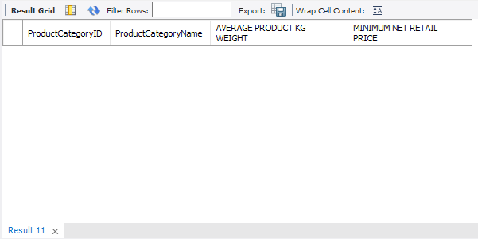
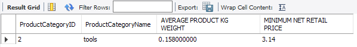

# Quick Intro 

We saw how aggregate functions can be useful, Eventually, however, we'll want to filter the aggregate function value of a query result. 

We know that the `WHERE` clause is used in filtering the query results from previous sections , but if we want to filter the query results of the aggregate functions values, the `WHERE` clause won't work.

For example, let's say we need to calculate the maximum value that's below a specific value or the average that matches a single value we want. The `HAVING` clause can helps do that. 

If we want to query the rows with MINIMUM NET RETAIL PRICE values greater than 5.00 we will do something like the following : 


```SQL
USE my_online_store;

SELECT PC.ProductCategoryID, PC.ProductCategoryName,
	   AVG(P.UnitKGWeight) AS 'AVERAGE PRODUCT KG WEIGHT',
	   MIN(P.NetRetailPrice) AS 'MINIMUM NET RETAIL PRICE'
	   
FROM ProductCategories PC 
INNER JOIN Products P 
	ON PC.ProductCategoryID = P.ProductCategoryID
	
GROUP BY PC.ProductCategoryName, PC.ProductCategoryID;
```


let's see what will happen if we tyred to filter the above query using the `WHERE` clause :

```SQL
USE my_online_store;
SELECT PC.ProductCategoryID, PC.ProductCategoryName,
	   AVG(P.UnitKGWeight) AS 'AVERAGE PRODUCT KG WEIGHT',
	   MIN(P.NetRetailPrice) AS 'MINIMUM NET RETAIL PRICE'
	   
FROM ProductCategories PC 
INNER JOIN Products P 
	ON PC.ProductCategoryID = P.ProductCategoryID
	
WHERE MIN(P.NetRetailPrice) > 5.00
GROUP BY PC.ProductCategoryName, PC.ProductCategoryID;
```


The `WHERE` clause only filters on the rows that its `SELECT` query sees. By design, the `WHERE` clause can't operate on row groups or row aggregates. The `HAVING` clause will solve the problem. Placing it below the `GROUP BY` clause in the query :

```SQL
USE my_online_store;
SELECT PC.ProductCategoryID, PC.ProductCategoryName,
	   AVG(P.UnitKGWeight) AS 'AVERAGE PRODUCT KG WEIGHT',
	   MIN(P.NetRetailPrice) AS 'MINIMUM NET RETAIL PRICE'

FROM ProductCategories PC 
INNER JOIN Products P 
	ON PC.ProductCategoryID = P.ProductCategoryID
	
GROUP BY PC.ProductCategoryName, PC.ProductCategoryID
HAVING MIN(P.NetRetailPrice) > 5.00;
```


Note that name alias won't work with the `HAVING` clause; that's because the SQL engine run the `HAVING` clause before the `SELECT` clause. This means that the `HAVING` clause doesn't support column name alias.

# Implementing the HAVING Clause

Let's practice the `HAVING` clause be using it to build a list of product categories that have more than 350 available items :

1. First we'll start with the basic query, joining the tables we need

```SQL
SELECT PC.ProductCategoryName,
	   SUM(P.AvailableQuantity) AS 'SUM PRODUCT CATEGORY IN PRODUCTS'

FROM Products P 
INNER JOIN ProductCategories PC 
	ON P.ProductCategoryID = PC.ProductCategoryID;
```

3. Now, let's add the `GROUP BY` clause and sort the results by `ProductCategoryName`

```SQL
SELECT PC.ProductCategoryName,
	   SUM(P.AvailableQuantity) AS 
		   'SUM PRODUCT CATEGORY IN PRODUCTS'
	   
FROM Products P 
INNER JOIN ProductCategories PC 
	ON P.ProductCategoryID = PC.ProductCategoryID
	
GROUP BY PC.ProductCategoryName
ORDER BY ProductCategoryName;
```

3. Finally, let's add the `HAVING` clause :

```SQL
SELECT PC.ProductCategoryName,
	   SUM(P.AvailableQuantity) AS 
		   'SUM PRODUCT CATEGORY IN PRODUCTS'
	   
FROM Products P 
INNER JOIN ProductCategories PC 
	ON P.ProductCategoryID = PC.ProductCategoryID
	
GROUP BY PC.ProductCategoryName

HAVING SUM(P.AvailableQuantity) > 350
ORDER BY ProductCategoryName;
```


# The Differences between the SQL HAVING and WHERE Clauses

AS we saw before the `WHERE` clause can't work with aggregate function columns. However, that `HAVING` clause can filter regular, or non-aggregate columns, But in order to do that the `GROUP BY` clause must be added to the query :

```SQL
USE my_online_store;
SELECT PC.ProductCategoryID, PC.ProductCategoryName,
	  AVG(P.UnitKGWeight) AS 'AVERAGE PRODUCT KG WEIGHT',
	  MIN(P.NetRetailPrice) AS 'MINIMUM NET RETAIL PRICE'
	  
FROM ProductCategories PC 
INNER JOIN Products P 
	ON PC.ProductCategoryID = P.ProductCategoryID
	
HAVING PC.ProductCategoryID = 2;
```



It did not work because we forgot the `GROUP BY` clause. If we add the `GROUP BY` clause, it will work:

```SQL
USE my_online_store;
SELECT PC.ProductCategoryID, PC.ProductCategoryName,
	   AVG(P.UnitKGWeight) AS 'AVERAGE PRODUCT KG WEIGHT',
	   MIN(P.NetRetailPrice) AS 'MINIMUM NET RETAIL PRICE'
	   
FROM ProductCategories PC 
INNER JOIN Products P 
	ON PC.ProductCategoryID = P.ProductCategoryID
	
GROUP BY PC.ProductCategoryID, PC.ProductCategoryName
HAVING PC.ProductCategoryID = 2;
```



We can also use both the `GROUP BY` and the `HAVING` clause in the same query like the following :

```SQL
USE my_online_store;
SELECT OI.OrderID, P.ProductName,
	   SUM((OI.UnitPrice - OI.Discount) * OI.Quantity) AS
			'TOTAL REVENUE PER PRODUCT PER ORDER'
			
FROM OrderItems OI 
INNER JOIN Products P 
	ON OI.ProductID = P.ProductID
	
WHERE OI.OrderID = 5

GROUP BY OI.OrderID, P.ProductName
HAVING SUM((OI.UnitPrice - OI.Discount) * OI.Quantity) > 4.50

ORDER BY 'TOTAL REVENUE PER PRODUCT PER ORDER' ASC;
```


In the above query, the `SUM` aggregate function requires the `GROUP BY` clause and the `HAVING` clause to filter it, the `WHERE` clause filters the `OrderItems.OrderID` values. as we said before we can use the `HAVING` clause to do all the filter in the query : 


```SQL
USE my_online_store;
SELECT OI.OrderID, P.ProductName,
	   SUM((OI.UnitPrice - OI.Discount) * OI.Quantity) AS
			'TOTAL REVENUE PER PRODUCT PER ORDER'
			
FROM OrderItems OI 
INNER JOIN Products P 
	ON OI.ProductID = P.ProductID
-- WHERE OI.OrderID = 5

GROUP BY OI.OrderID, P.ProductName
HAVING (SUM(
	(OI.UnitPrice - OI.Discount) * OI.Quantity) > 4.50)	
	AND 
	(OI.OrderID = 5)

ORDER BY 'TOTAL REVENUE PER PRODUCT PER ORDER' DESC
```


However, we want as much filtering as possible to happen in the `WHERE` clause and as little as possible in the `HAVING` clause.

As MySQL runs a query, it evaluates the `WHERE` clause early on.  This eliminates as many rows as possible as early as possible. 

MySQL then runs the `GROUP BY` clause if it sees one, and then runs the `HAVING` clause if it sees one.

If a query eliminates as many rows as possible with the `WHERE` clause, MySQL can avoid operations on fewer rows. That way, it will use fewer resources and the query will have better performance.