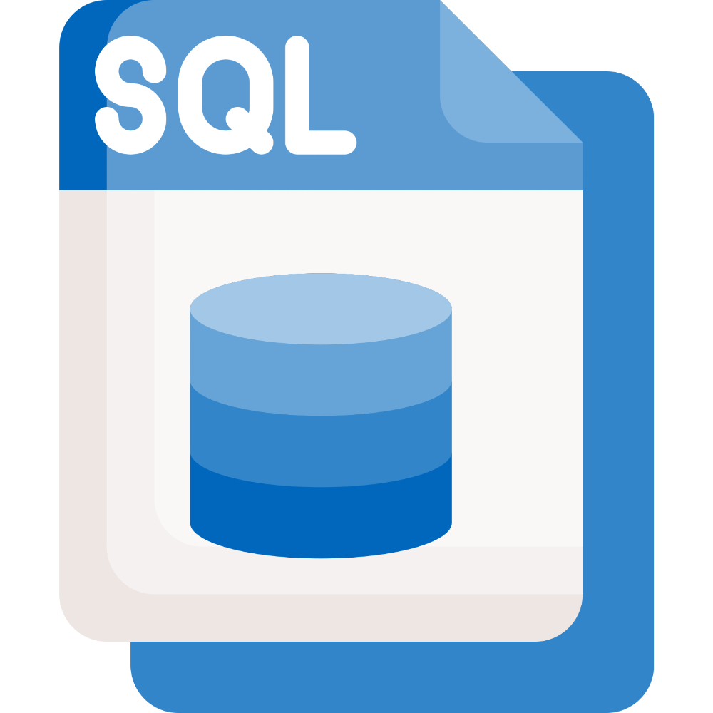

  

<h1 align="center">QUICK SQL</h1>

---

 This repository goes through what is SQL and how to quickly get started with it.
      

- [🔰 Tutorials](#-tutorials)
  - [💠 SQL and RDBMS :](#-sql-and-rdbms-)
  - [🟡 STARTING WITH THE BASICS](#-starting-with-the-basics)
    - [📌 Manipulating Data In SQL :](#-manipulating-data-in-sql-)
    - [📌 Querying Data In SQL :](#-querying-data-in-sql-)
  - [🟠 ADVANCED QUERY TECHNIQUES](#-advanced-query-techniques)
  - [✍️ Authors ](#️-authors-)
  - [🎉 Acknowledgements ](#-acknowledgements-)

## 🧐 About 

The purpose of this REPO is to create an Easy and Accessible SQL Wiki for people interested in learning SQL.

***

Examples used in these tutorials are from the `The SQL Workshop` Book, the book is great and highly recommend. You can get it on [Amazon](https://www.amazon.com/SQL-Workshop-Interactive-Approach-Learning/dp/1838642358), or by joining our [Telegram Channel](https://t.me/project_data_channel).

## 🏁 Getting Started 

### 🔽 Prerequisites 
The SQL engine used throughout the examples is **MySQL**, you can follow this tutorial on how to download it [HERE.](https://www.javatpoint.com/how-to-install-mysql#:~:text=Step%201%3A%20Go%20to%20the,community%20server%2C%20which%20you%20want.)

### 🧱 Setting up databases
After installing **MySQL** on your machine, run these scripts to create the databases schemas used in the tutorials [HERE.](https://github.com/hossam-elshabory/Quick-SQL-For-Data/tree/main/Scripts)

# 🔰 Tutorials 

## 💠 SQL and RDBMS :

- [What Is SQL](https://github.com/hossam-elshabory/Quick-SQL-For-Data/tree/main/1.%20SQL%20and%20RDBMS/01.%20What%20Is%20SQL)
- [What Are RDBMS](https://github.com/hossam-elshabory/Quick-SQL-For-Data/tree/main/1.%20SQL%20and%20RDBMS/02.%20What%20Are%20RDBMS)

## 🟡 STARTING WITH THE BASICS
### 📌 Manipulating Data In SQL :

- [SQL Basics](https://github.com/hossam-elshabory/Quick-SQL-For-Data/tree/main/2.%20STARTING%20WITH%20THE%20BASICS/Manipulating%20Data%20In%20SQL/01.%20SQL%20Basics)
- [Creating Databases and Tables](https://github.com/hossam-elshabory/Quick-SQL-For-Data/tree/main/2.%20STARTING%20WITH%20THE%20BASICS/Manipulating%20Data%20In%20SQL/02.%20Creating%20Databases%20and%20Tables)
- [The INSERT Operation](https://github.com/hossam-elshabory/Quick-SQL-For-Data/tree/main/2.%20STARTING%20WITH%20THE%20BASICS/Manipulating%20Data%20In%20SQL/03.%20The%20INSERT%20Operation)
- [The DELETE Operation](https://github.com/hossam-elshabory/Quick-SQL-For-Data/tree/main/2.%20STARTING%20WITH%20THE%20BASICS/Manipulating%20Data%20In%20SQL/04.%20The%20DELETE%20Operation)
- [The ALTER Operation](https://github.com/hossam-elshabory/Quick-SQL-For-Data/tree/main/2.%20STARTING%20WITH%20THE%20BASICS/Manipulating%20Data%20In%20SQL/05.%20The%20ALTER%20Operation)
- [The UPDATE Operation](https://github.com/hossam-elshabory/Quick-SQL-For-Data/tree/main/2.%20STARTING%20WITH%20THE%20BASICS/Manipulating%20Data%20In%20SQL/06.%20The%20Update%20Operation)
- [The DROP Operation](https://github.com/hossam-elshabory/Quick-SQL-For-Data/tree/main/2.%20STARTING%20WITH%20THE%20BASICS/Manipulating%20Data%20In%20SQL/07.%20The%20DROP%20Operation)

### 📌 Querying Data In SQL :

- [Using The SELECT Statement](https://github.com/hossam-elshabory/Quick-SQL-For-Data/tree/main/2.%20STARTING%20WITH%20THE%20BASICS/Querying%20Data%20In%20SQL/08.%20Using%20The%20SELECT%20Statement)
- [Sorting Results](https://github.com/hossam-elshabory/Quick-SQL-For-Data/tree/main/2.%20STARTING%20WITH%20THE%20BASICS/Querying%20Data%20In%20SQL/09.%20Sorting%20Results)
- [Using LIMIT and DISTINCT](https://github.com/hossam-elshabory/Quick-SQL-For-Data/tree/main/2.%20STARTING%20WITH%20THE%20BASICS/Querying%20Data%20In%20SQL/10.%20Using%20LIMIT%20and%20DISTINCT)
- [Calculating Mathematical Expressions](https://github.com/hossam-elshabory/Quick-SQL-For-Data/tree/main/2.%20STARTING%20WITH%20THE%20BASICS/Querying%20Data%20In%20SQL/11.%20Calculating%20Mathematical%20Expressions)
- [Filtering With The WHERE Clause](https://github.com/hossam-elshabory/Quick-SQL-For-Data/tree/main/2.%20STARTING%20WITH%20THE%20BASICS/Querying%20Data%20In%20SQL/12.%20Filtering%20With%20The%20WHERE%20Clause)
- [The LIKE Operator](https://github.com/hossam-elshabory/Quick-SQL-For-Data/tree/main/2.%20STARTING%20WITH%20THE%20BASICS/Querying%20Data%20In%20SQL/13.%20The%20LIKE%20Operator)
- [Joining Tables](https://github.com/hossam-elshabory/Quick-SQL-For-Data/tree/main/2.%20STARTING%20WITH%20THE%20BASICS/Querying%20Data%20In%20SQL/14.%20Joining%20Tables)  

## 🟠 ADVANCED QUERY TECHNIQUES

- [Leveraging Sub-Queries](https://github.com/hossam-elshabory/Quick-SQL-For-Data/tree/main/3.%20ADV-QUERY%20TECHNIQUES/01.%20Leveraging%20Sub-Queries)
- [CASE Statements In SQL](https://github.com/hossam-elshabory/Quick-SQL-For-Data/tree/main/3.%20ADV-QUERY%20TECHNIQUES/02.%20CASE%20Statements%20In%20SQL) 
- [Encapsulate Complex Queries With Views](https://github.com/hossam-elshabory/Quick-SQL-For-Data/tree/main/3.%20ADV-QUERY%20TECHNIQUES/03.%20Encapsulate%20Complex%20Queries%20With%20Views) 
- [Aggregate Functions And The GROUP BY Clause](https://github.com/hossam-elshabory/Quick-SQL-For-Data/tree/main/3.%20ADV-QUERY%20TECHNIQUES/04.%20Aggregate%20Functions%20And%20The%20GROUP%20BY%20Clause)
- [Filtering GROUP BY With HAVING](https://github.com/hossam-elshabory/Quick-SQL-For-Data/tree/main/3.%20ADV-QUERY%20TECHNIQUES/05.%20Filtering%20GROUP%20BY%20With%20HAVING)

## ✍️ Authors 
- [@hossam elshabory](https://github.com/hossam-elshabory)

## 🎉 Acknowledgements 
+ [The The SQL Workshop](https://www.packtpub.com/product/the-sql-workshop/9781838642358) - For Examples & Concepts.
+ [W3 School Join Tutorial](https://www.w3schools.com/mysql/mysql_join.asp) - SQL Joins illustrations.